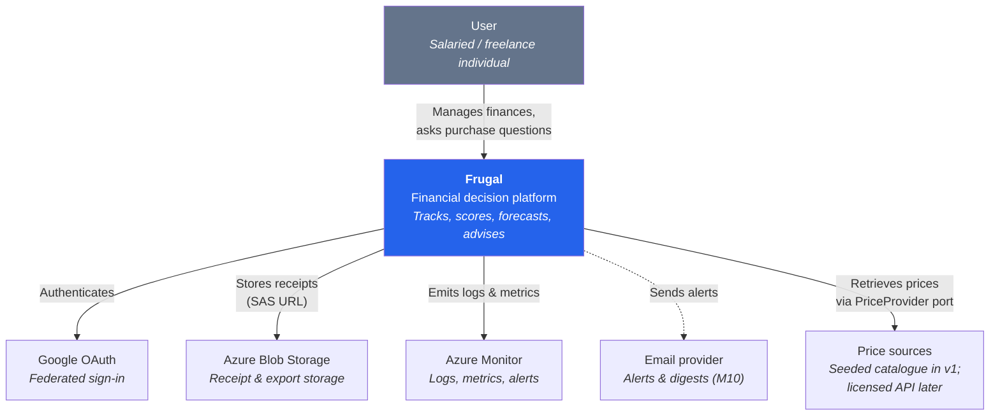
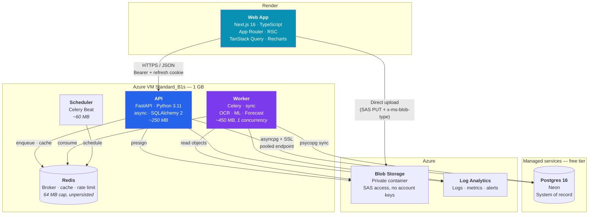
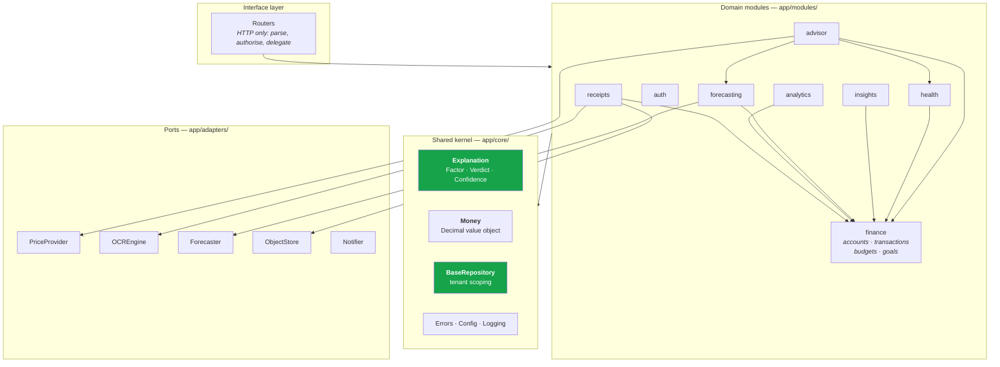
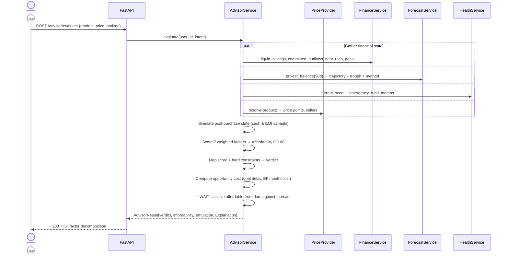
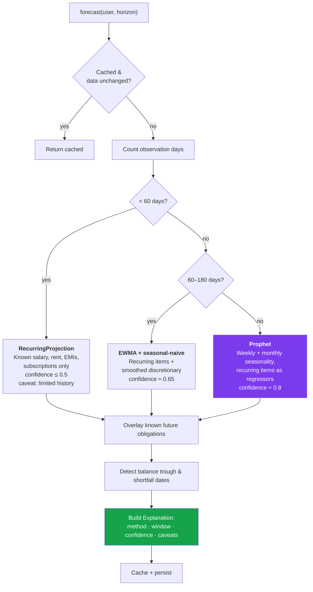
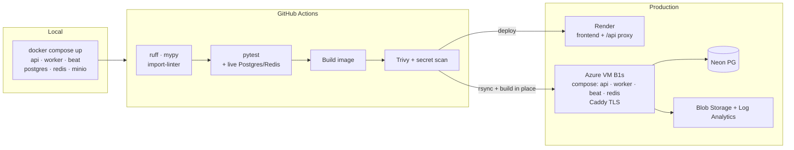
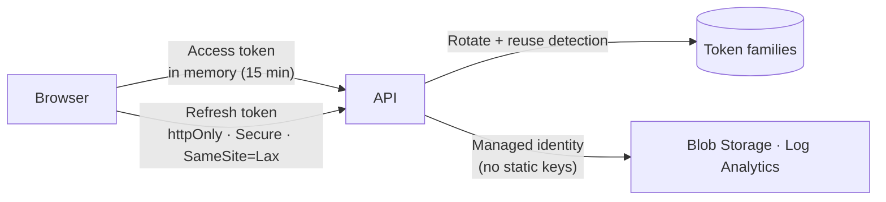

# Frugal — High-Level Architecture

**Version:** 1.0 · **Last updated:** 2026-08-04
**Companion documents:** [SRS](01-srs.md) · [Data model](03-data-model.md) · [API design](04-api-design.md) · [ADRs](adr/)

---

## 1. Architectural drivers

Six forces shape every decision below. Where they conflict, the earlier one wins.

| # | Driver | Consequence |
|---|---|---|
| 1 | **Explainability is the product** | Engines return a shared typed `Explanation`. No engine may emit a score without its factor decomposition. |
| 2 | **1 GB of application RAM** | Postgres and Redis are managed externally. Heavy libraries load lazily, in workers only. |
| 3 | **Solo developer, 12 modules** | Modular monolith. One deployable, one migration history, one test suite. |
| 4 | **Extraction must stay cheap** | Hard module boundaries enforced by tooling, so any module can become a service without a rewrite. |
| 5 | **External sources are unstable and legally constrained** | Every external dependency sits behind a port with a fake. |
| 6 | **CPU-bound AI work must not block the API** | Async API process, synchronous Celery workers, strict separation. |

---

## 2. C4 Level 1 — System context



Dashed edges are v1.1. Note that **Price sources** connects through a port, not directly — v1 satisfies
it with a seeded catalogue, and the system cannot tell the difference.

---

## 3. C4 Level 2 — Containers



**Why the frontend uploads directly to object storage.** Routing 10 MB receipt images through a 1 GB
API process would consume request-worker memory and stall the event loop. A presigned PUT keeps image
bytes entirely out of the API. The API only ever handles the object key.

**Why Redis sits on the VM rather than in the managed box.** Upstash's free tier is 500k commands per
*month*, and an idle Celery worker BRPOPs its queues about once a second — roughly 2.6M. The broker
would stop answering a week into every month, and the symptom would be tasks silently not running. It
holds only regenerable state, so it is capped at 64 MB and unpersisted rather than treated as a
database (ADR-006).

**Why only Postgres is managed.** It is the one dependency whose loss is not recoverable. That
placement is also what made changing cloud cheap: when the deployment moved from AWS to Azure, the
financial data did not move at all — only the VM and the object store did
([ADR-010](adr/010-azure-migration.md)).

**Why the worker runs at concurrency 1.** OpenCV, Tesseract, and Prophet are memory-heavy and
CPU-bound. A second concurrent worker on t3.micro is an OOM kill. Throughput comes from queue
prioritisation, not parallelism, at this tier.

---

## 4. C4 Level 3 — Backend module structure



### 4.1 The boundary rule

Each module owns `models.py`, `schemas.py`, `service.py`, `repository.py`, `router.py`.

**A module may import:** `app.core.*`, `app.adapters.*` (ports only), and the *service interface* of
another module.

**A module may never import:** another module's `models.py`, `repository.py`, or internal helpers.
No cross-module ORM relationship or JOIN.

This is enforced by an `import-linter` contract in CI. It is a build failure, not a code-review note —
which is the entire point. Boundary rules maintained by discipline decay; boundary rules maintained by
a failing build do not.

**Why this matters concretely:** the advisor consumes forecasting, health, and finance. If those were
joined at the ORM level, extracting forecasting into its own service later would mean rewriting the
advisor. Because they communicate through service calls returning DTOs, extraction means swapping a
local call for an HTTP client behind the same interface.

### 4.2 Dependency direction

Dependencies point **inward**: routers → services → repositories → models, and everything → core.
Core imports nothing from modules. Ports are defined in `core`/`adapters` as protocols; concrete
adapters are wired at composition time in `app/main.py`. Services depend on the protocol, never the
implementation — which is what makes every AI path testable without network, credentials, or a GPU.

---

## 5. The Explanation contract

The one abstraction the entire product hangs on.

```python
class Direction(StrEnum):
    POSITIVE = "positive"    # improves the outcome
    NEGATIVE = "negative"    # worsens it
    NEUTRAL  = "neutral"

class Factor(BaseModel):
    name: str                # "Emergency fund coverage"
    value: str               # "3.2 months"
    raw_value: Decimal
    weight: Decimal          # rubric weight, 0..1
    contribution: Decimal    # signed points contributed to the score
    direction: Direction
    explanation: str         # why this factor matters, in plain language

class Explanation(BaseModel):
    verdict: str | None      # BUY_NOW · WAIT · HEALTHY · AT_RISK ...
    score: Decimal | None    # 0..100
    confidence: Decimal      # 0..1, calibrated
    method: str              # "prophet" · "ewma" · "rubric_v2"
    data_window: DataWindow  # start, end, observation count
    factors: list[Factor]    # MUST be non-empty when score or verdict is set
    caveats: list[str]       # "Only 45 days of history — treat as provisional"
    computed_at: datetime
```

Enforced by a Pydantic model validator: a non-null `score` or `verdict` with an empty `factors` list
raises. An unexplainable recommendation cannot be serialised, so it cannot reach the user.

**System-wide payoff.** Health, insights, forecasting, advisor, and (in v1.1) reliability scoring all
emit this shape. The frontend renders all five with one `<ExplanationPanel>` component. Twelve modules,
one mental model — for the user and for the code.

---

## 6. Key flows

### 6.1 Receipt processing

```mermaid
sequenceDiagram
    actor U as User
    participant FE as Next.js
    participant API as FastAPI
    participant S3
    participant Q as Redis
    participant W as Worker
    participant DB as Postgres

    U->>FE: Select receipt image
    FE->>API: POST /receipts/upload-url
    API->>API: Validate type & size; generate key
    API->>S3: Presign PUT (5 min TTL)
    API-->>FE: {upload_url, receipt_id}
    FE->>S3: PUT image bytes (direct)
    FE->>API: POST /receipts/{id}/process
    API->>DB: status = QUEUED
    API->>Q: enqueue process_receipt
    API-->>FE: 202 Accepted

    Note over FE: Poll status

    W->>Q: consume
    W->>S3: GET object
    W->>W: OpenCV: perspective → deskew → denoise → threshold
    W->>W: Tesseract OCR (image_to_data, per-token confidence)
    W->>W: Extract merchant · date · total · tax · line items
    W->>W: Score confidence per field
    alt All fields above threshold
        W->>DB: status = READY; propose transaction
    else Any field below threshold
        W->>DB: status = NEEDS_REVIEW; flag fields
    end
    W->>DB: Persist extraction + confidences

    FE->>API: GET /receipts/{id}
    API-->>FE: Fields + per-field confidence + flags
    U->>FE: Correct flagged fields, confirm
    FE->>API: POST /receipts/{id}/commit
    API->>API: Duplicate check (content hash)
    API->>DB: Create transaction
```

The confidence score is carried per field, not per receipt. A receipt with a confident total and an
ambiguous date should only ask the user about the date — asking them to re-verify everything is how
human-in-the-loop UX gets abandoned.

### 6.2 Purchase advisor — the flagship path



Note the four gathers run concurrently — the advisor's latency budget is dominated by the forecast, so
serialising them would be the difference between 800 ms and 3 s.

**Hard constraints override the score.** A high affordability score still yields `NOT_RECOMMENDED` if
the purchase drives emergency-fund coverage below one month or the forecast trough below zero. A
weighted score alone can average away a disqualifying condition; explicit guard rails cannot.

### 6.3 Tiered forecasting



**Why tiering rather than Prophet everywhere.** Prophet requires roughly two seasonal cycles to fit
anything meaningful. A three-week-old account fed to Prophet produces a confident-looking curve built
on noise — the worst possible failure mode for a product whose thesis is trustworthy explanation.
Tiering makes the model's limits visible instead of hiding them, and `method` + `caveats` travel with
every response so the UI can say *"based on 45 days, provisional"* rather than implying certainty.

Prophet is imported inside the tier-3 function body, not at module scope — the API process never pays
its ~400 MB.

---

## 7. Data architecture

**Postgres is the single system of record.** Redis holds only regenerable state: Celery broker,
computed-aggregate cache, and rate-limit counters. Losing Redis degrades performance, never data.

**Caching.** Read-through on expensive aggregates (dashboard, health, forecast), keyed by
`user_id + scope + data_version`. `data_version` is bumped on any transaction write, which invalidates
by construction rather than by TTL guesswork — stale financial numbers are worse than slow ones.

**Async and sync coexistence.** The API uses `asyncpg` (async engine); workers use `psycopg` (sync
engine). Both map the same declarative models. Two engines, one schema — the alternative, forcing
async into CPU-bound OCR/ML code, buys nothing and complicates everything.

**Job durability.** Every Celery task is idempotent, keyed by a job row in Postgres. Retries are
exponential with jitter; terminal failures persist the exception to a dead-letter table. Job state
lives in Postgres, not Redis, so a Redis eviction can't lose a user's receipt.

---

## 8. Deployment



Local development uses containerised Postgres, Redis, and **MinIO** as an S3-compatible store, so no
cloud credentials are needed to develop and tests never touch real infrastructure. The `ObjectStore`
port makes MinIO, S3, and Azure Blob interchangeable — which is what
[ADR-010](adr/010-azure-migration.md) actually cashed in when the deployment changed cloud.

The VM builds from source rather than pulling a tagged image: a container registry is a recurring
charge (Azure Container Registry Basic is ~$5/month, billed idle) that would be more than half the
cost of the VM it serves. Rollback is `git checkout` plus a redeploy, which is slower than re-pointing
a tag and is the right trade at one instance.

### 8.1 Cost safety comes before the deployment target

**No cloud provider offers a hard spending cap.** Budgets alert; they do not
stop. For a deployment where an unexpected bill would genuinely hurt, the
property that decides the target is not the feature list — it is what happens
when the money runs out.

Every service in the production stack is chosen for one property: **it stops
serving rather than billing** when its free allowance is exhausted.

| Concern | Service | Behaviour at the limit |
|---|---|---|
| Frontend | Render free | Sleeps after 15 min idle; 750 h/month |
| API + worker + beat | Azure VM, student subscription | Subscription disabled — no payment method on file |
| Postgres | Neon free | Paused |
| Object storage | Azure Blob, same subscription | Disabled with the subscription |
| Offer search | SerpAPI free plan | Hard-stops; local ledger stops first (ADR-008) |

The architecture is what makes the target a config choice rather than a rewrite:
the `ObjectStore` port (ADR-004) covers S3, R2, MinIO and Azure Blob, and
Postgres was never on the compute provider at all.
[`infra/azure/COST-SAFETY.md`](../infra/azure/COST-SAFETY.md) carries the
runbook and the budget; [`infra/aws/`](../infra/aws/) still holds the previous
EC2 stack, and [ADR-010](adr/010-azure-migration.md) records why the target
moved — a six-month clock, not a cost scare.

### 8.2 Free-tier budget

Against the $100 Azure for Students credit, which has to last twelve months —
about **$8.33/month**.

| Service | Tier | Limit | Headroom |
|---|---|---|---|
| Render free | Free | 750 h/mo, sleeps when idle | Adequate; first request after idle is slow |
| Azure VM `Standard_B1s` | Free 12 mo (750 h) | 1 vCPU / 1 GB | Full-time single instance |
| Standard SSD, 32 GiB | ~$2.40/mo | — | Billed from credit |
| Static public IP | ~$3.65/mo | — | Billed from credit; Basic SKU retired Sept 2025 |
| Neon Postgres | Free | 0.5 GB storage | ~500k transactions |
| Azure Blob | Free 12 mo | 5 GB | ~5k receipts; expire at 90 days |
| Log Analytics | Free | 5 GB/mo ingest | Capped at 1 GB/day on the workspace |

**Memory budget on B1s (1 GB):** API ≈ 250 MB + Worker ≈ 450 MB + Beat ≈ 60 MB + Redis ≤ 64 MB +
Caddy ≈ 20 MB + OS ≈ 150 MB ≈ **994 MB**. Tight by design, which is exactly why Postgres is external,
Redis is capped and unpersisted, and `torch` is excluded. A 2 GB swap file absorbs Prophet's fit-time
spikes.

---

## 9. Security architecture



- **Token placement.** Access tokens live in JavaScript memory and die with the tab; refresh tokens
  live in an httpOnly cookie unreadable by script. The common `localStorage` pattern hands both to any
  successful XSS payload.
- **Rotation with reuse detection.** Each refresh issues a new token and invalidates the old. A
  replayed token means theft, so the entire family is revoked.
- **Tenant isolation at the data layer.** `BaseRepository` injects `user_id` into every query. A test
  asserts that no repository method can construct an unscoped query against a user-owned table. This
  is the class of bug that leaks another user's finances, so it is closed structurally rather than
  procedurally.
- **Storage.** The container is private with anonymous access blocked; SAS URLs are scoped to a
  single blob with a short TTL and are generated per request, never stored. Receipts are PII.
  A read URL also pins the response content type to the type recorded when the upload was
  authorised, so bytes smuggled past the upload check are never served as a document
  ([ADR-010](adr/010-azure-migration.md)).
- **Least privilege.** The VM's system-assigned managed identity holds `Storage Blob Data
  Contributor` on one storage account and nothing else, and SAS URLs are signed with a 24-hour user
  delegation key issued over Entra ID. **Shared account keys are disabled on the account**, so no
  long-lived storage credential exists to leak — not in the repository, not in a log, not on the
  host.

---

## 10. Rejected alternatives

| Considered | Rejected because |
|---|---|
| **Microservices from day one** | Solo developer. Distributed tracing, network failure modes, and per-service deploys cost more than they return at this scale. ADR-001 buys the extraction path instead. |
| **All services on one VM, Postgres included** | Postgres + Redis + worker + API on 1 GB OOMs on the first Prophet fit, and it puts the one irreplaceable dependency on the one host that gets destroyed and rebuilt. Neon's free tier costs $0 and removes both. |
| **Azure Container Apps instead of a VM** | Its free grant suits things that scale to zero, and Celery's worker and beat do not — one worker at 0.25 vCPU running continuously is ~648k vCPU-seconds/month against a 180k grant. It would also need a registry and a managed Redis. |
| **Prophet as the only forecaster** | Undefined below ~2 seasonal cycles. Confidently wrong output directly contradicts the product thesis. |
| **Direct retailer scraping** | ToS violation, defeated by anti-bot defences, unbounded maintenance, and real liability for a commercial product. Port + adapter defers this decision without blocking the feature. |
| **LLM-generated recommendations** | Non-reproducible and non-auditable. Explainability is the differentiator; a black box would erase it. |
| **Serverless (Lambda)** | Cold starts against a 400 MB Prophet dependency, and 15-minute limits are awkward for batch ML. Poor fit for long CPU-bound jobs. |
| **GraphQL** | Single known client with well-understood access patterns. REST + generated OpenAPI types gives type safety without the resolver complexity. |
| **Storing money as float/integer paise only** | Float is a correctness defect. Integer minor units work but make every read site do conversion; `Numeric(18,2)` + a `Money` object is safer and clearer. |

---

## 11. Evolution path

The architecture is designed so growth is additive rather than corrective:

- **Scale reads** → replica + read-through cache; the repository layer already isolates queries.
- **Scale workers** → separate queues by workload (`ocr`, `ml`, `forecast`) onto a second instance; Celery routing is config, not code.
- **Extract a service** → forecasting or receipts are the natural first candidates. Because callers depend on a service interface returning DTOs, extraction swaps a local call for an HTTP client behind the same signature.
- **Real price data** → implement one `PriceProvider` adapter. No product-logic change.
- **Better categorisation** → the `Categoriser` interface admits an embedding model; the eval harness proves the upgrade before it ships.

---

*Next: [03-data-model.md](03-data-model.md)*
